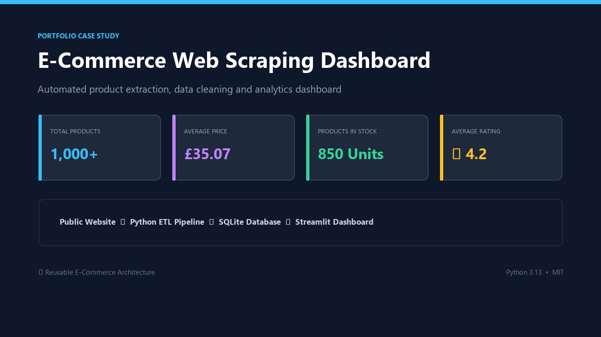
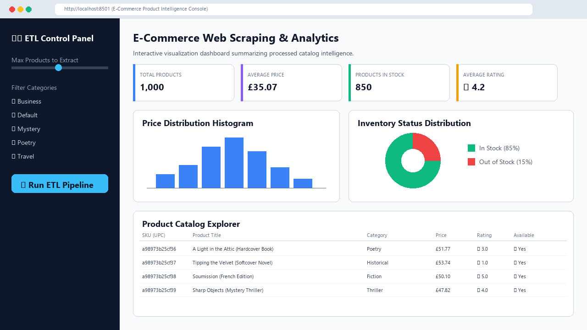

# E-Commerce Web Scraping & Analytics Dashboard



A completed data automation solution that extracts public product data from an e-commerce website, cleans and standardizes the dataset, exports business-ready files, stores the data in SQLite, and presents the results in an interactive analytics dashboard.

This project was built as a practical freelance-style delivery for use cases such as product catalog extraction, competitor price monitoring, marketplace research, inventory tracking, and automated reporting.

## Final Delivery

- Automated multi-page web scraping pipeline
- Clean product dataset in CSV format
- Excel export for business users
- SQLite database for structured storage
- Interactive Streamlit analytics dashboard
- Product price analysis
- Product availability analysis
- Rating distribution analysis
- Searchable data explorer
- Downloadable processed dataset

## Dashboard Preview



## Business Value

This solution replaces manual product data collection with an automated workflow that extracts, cleans, structures, and visualizes product information.

It helps businesses monitor product catalogs, analyze prices, track availability, prepare reporting files, and create reusable datasets for BI or operational analysis.

## Data Workflow

Public Website → Python Scraper → Raw CSV → Data Cleaning → SQLite / Excel / CSV → Streamlit Dashboard

## Key Features

- Product title extraction
- Price cleaning and numeric conversion
- Rating conversion into structured values
- Availability standardization
- Duplicate removal
- CSV and Excel export
- SQLite database storage
- Interactive dashboard with KPIs, charts, filters and downloadable data

## Tech Stack

Python, Requests, BeautifulSoup, Pandas, SQLite, Streamlit, Plotly, Excel, CSV

## Freelance Use Cases

This type of solution can be adapted for:

- Competitor price monitoring
- Product catalog extraction
- Marketplace research
- Inventory availability tracking
- Business directory scraping
- Automated reporting datasets
- E-commerce analytics
- Data collection for dashboards

## Repository Structure

```text
fiverr-web-scraping-dashboard/
│
├── app.py                   # Main Streamlit dashboard application
├── requirements.txt         # Project library dependencies
├── .gitignore               # Excludes caches, venvs, and database outputs
├── README.md                # Project case-study documentation
│
├── data/                    # CSVs, Excel sheets, and SQLite database
├── src/                     # Python pipeline modules (scraper, transformer, database, utils)
└── assets/                  # Cover illustration and portfolio copy
```

## How to Run Locally

### 1. Create and Activate Virtual Environment
```powershell
python -m venv venv
venv\Scripts\activate
```

### 2. Install Dependencies
```powershell
pip install -r requirements.txt
```

### 3. Run Pipeline Stages
```powershell
python src/scraper.py --max-books 50 --delay 1.0
python src/transformer.py
python src/database.py
```

### 4. Run Streamlit Dashboard
```powershell
streamlit run app.py
```
*Your browser will automatically open to `http://localhost:8501`.*
